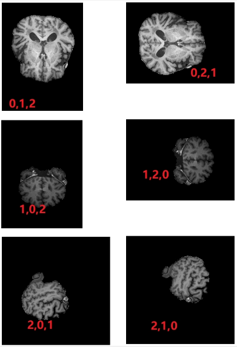

# MRILoader

version 1.5 2022/4/29

[日本語ドキュメント](https://github.com/su797/MRILoader/blob/main/README_ja.md)

## 介绍

本项目主要解决了nii、nii.gz格式的MRI图像单通道，且没有被归一化的问题，并进一步封装，让数据更规整更容易解析。同时提供了一些辅助方法。

## 准备

依赖及环境

<code>
    Python 3.7、
    opencv、
    numpy、
    SimpleITK
</code>

<p>
    由于是一个轻量级项目，直接提供了MRILoader.py文件，放入项目适当的文件夹内即可。之后在适当的文件内进行引用。
</p>
<code>from MRILoader import MRILoader,MultipleMRILoader
</code>

引入后可以使用test.py文件对类进行测试。

## 前提知识

**切片(Slice)**:由于MRI输出的图像是三维图，也就是(切片数,w,h)，由多张图片组成，每一张图片我们称之为切片。

**归一化(Normalize)**:由于nii、nii.gz读取到的MRI切片的像素值上限不固定，很多时候最高像素值都是几百甚至上千，而我们平时RGB图则是0到255，因此我们需要将切片的像素值统一到0到255，这也就是normalize方法的作用。可以使用getNormalizeSlices方法来获取归一化后的切片数组。

**三通道化(Ternary)**:可以理解为转换为RGB，经过归一化以后，MRI切片的像素值已经变为0~255，但是依然是单通道（灰度）图，为了方便处理，我们将其转换为三通道，这也就是normalizeSlicesToTernary的作用。可以使用getNormalizeSlicesTernary方法来获取三通道化后的图片数组。

**切片的方向(position)**:由于我们读取到的MRI切片方向都是不固定的，不一定是正确的方向，因此我们可以通过调整通道的方式，获取三个不同的断面，本类以基于第0维[(0,1,2)、(0,2,1)]为水平断面，第1维[(1,2,0),(1,0,2)]为冠状断面，第2维[(2,1,0),(2,0,1)]为矢状断面的数据为基准（如下图）。



但这样的数据依然方向是有问题的，本类以此为基准，在构造方法、getChangePostionSlices和getMultiplePositionSlices等方法中，为position参数提供指定的断面字符串的情况下，可以进行自动扶正，但如果是不同排列的数据则需要通过调整rot90和flip参数进行手动扶正。

**切片旋转(rot90)**:以90度为单位顺时针或逆时针旋转切片，基于Numpy的rot90方法，但由于MRI切片的特殊性，很可能无法按照预期旋转，需要通过调换维度，以及与flip的混合使用以达到旋转至指定方向的效果。

**切片翻转(flip)**:上下翻转或左右翻转，基于Numpy的flip方法，但由于MRI切片的特殊性，很可能无法按照预期翻转，需要通过调换维度，以及与rot90的混合使用以达到翻转至指定方向的效果。

**纯黑帧(Black Frame)**:在本类中很多方法都有black参数，这是因为MRI切片数组中，会有大量的纯黑色的切片，将black参数设置为False即可去除这些黑色的切片。

**元组(tuple)、列表(list)**:在本类中，通常需要元组、列表类型的地方都做了相互支持，因此使用哪种数据类型都可以。在注释表述上可能会存在数组的表单，这种时候通常为读取到的切片数据，一般为Array类型（也可能有列表的情况，有疑惑的话请自行验证）。

## 成员方法

### MRILoader类（适用于读取单一MRI文件）

<h4>构造方法 __init__(self, path=None,slices=None,position=None,rot90=None,flip=None)</h4>

<p>
我们在初始化MRILoader对象时，可以直接将MRI的文件路径传递给MRILoader的path参数，这样就会自动读取对应文件。<br/>
由于MRI通常有三个断面（水平断面、冠状断面、矢状断面），在进行归一化时，由于会压缩像素值，所以三个断面需要分别进行归一化，否则会发生严重的分层现象。使用构造方法初始化时仅会对一个方向的断面进行初始化（未指定的话就对读取的文件原始数组默认方向进行初始化）如果需要指定方向，可以通过position、rot90、flip三个参数进行调整。如果之后需要调整方向，则需要调用getChangePostionSlices或getMultiplePositionSlices方法，这两个方法均不会直接影响到类内的成员变量。
</p>

<b>参数列表</b>

- **path:** nii数据的路径

- **slices:** 原始未经处理的MRI切片数组。如果传入数组则不会读取path。

- **postion**:

  MRI的切片维度方位，接收值为三个成员的元组或字符串。

  传入元组时，基于numpy的transpose方法，通过使用rot90、flip参数调换维度的方式更改MRI切片方向，如果不知道如何调换可以传入字符串由方法自动调换。

  传入元组时可以使用，rot90（基于numpy的rot90方法）、flip（基于numpy的flip方法）参数调节视图方向
  
  - axial或transverse或z 水平断面
  - coronal或x 冠状面
  - sagittal或y 矢状面

​		但要注意，由于传入的MRI切片数组数据的不同，可能无法正确读取对应面，请自行确认。

​		传入字符串时同样可以使用rot90、flip参数调节视图方向，如果不传入rot90和flip，将由方法内置逻辑对切片方位进行处

- **rot90:** 切片旋转，以90度为单位，传入正值为逆时针，负值为顺时针，传入1代表逆时针旋转90度，2代表逆时针旋转180度，-1代表顺时针旋转90度，以此类推。 但要注意，MRI切片数组较为特殊，有时并不会以期待的方式运行，需要自行调节。

- **flip:** 切片翻转，输入值为维度，输入0为上下翻转，输入1为左右翻转。 但要注意，MRI切片数组较为特殊，有时并不会以期待的方式运行，需要自行调节。

  ```python
  loader = MRILoader('./data/CC003/T1w_bscorr_SS.nii.gz')
  ```
  
  

<h4>.normalize() </h4>
<p>
本方法通常会被自动调用，一般无需手动调用。<br/>
对读取到数据进行归一化，归一化后值变为0~255，但这时还是单通道，因此不能直接作为图片输出（matplotlib 的话可以）。本方法会被getNormalizeSlices、normalizeSlicesToTernary自动调用
</p>

<h4>.normalizeSlicesToTernary(reset=False)</h4>
<p>
本方法通常会被自动调用，一般无需手动调用。<br/>
本方法可以将归一化后的单通道数据转为三通道。如果之前没有进行归一化，会自动进行归一化。本方法会被getNormalizeSlicesTernary、display、save自动调用。
</p>

**参数列表**

- **reset**:默认值False，为True时即便是已经被三通道化过了，也重新进行三通道化

<h4>.getNormalizeSlices(black=True,reset=False,reset=False)</h4>
<p>
获取归一化后的MRI切片图，如果没有归一化会自动进行归一化
</p>

**参数列表**

- **black**:是否包含纯黑的切片，如果包含的话就是True（默认），如果希望不包含的话就是False。
- **reset**:默认值False，为True时即便是已经被三通道化过了，也重新进行三通道化

```python
normalize=loader.getNormalizeSlices()
```


<h4>.getNormalizeSlicesTernary(black=True,reset=False)</h4>
<p>
获取三通道化后的MRI切片图，如果没有三通道化会自动进行三通道化（同样如果没有归一化，会先进行归一化再进行三通道化）。(切片序号,w，h)


**参数列表**

- **black**:是否包含纯黑的切片，如果包含的话就是True（默认），如果希望不包含的话就是False。
- **reset**:默认值False，为True时即便是已经被三通道化过了，也重新进行三通道化

```python
normalizeSlicesTernary=loader.getNormalizeSlicesTernary()
```


<h4>.changePosition(slices,position,rot90=None,flip=None,black=True,type='ternary',consistent=False)</h4>

<p>获取指定方位的MRI切片数组。通常来说不会直接调用此方法，想要获取指定方位的MRI切片数组请getChangePostionSlices方法进行</p>

**参数列表**

- **slices:** MRI切片数组（必须是并未经本方法或其他方法改变数组维度的单通道原始数组，因为必须改变断面后再进行归一化和三通道，否则会出现断层问题）

- **postion**:

  MRI的切片维度方位，接收值为三个成员的元组/列表或字符串。

  维度方位，接收值为三个成员的元组/列表。 传入元组/列表时，基于numpy的transpose方法，可以使用rot90（基于numpy的rot90方法）、flip（基于numpy的flip方法）参数调节视图方向

- **rot90:** 切片旋转，以90度为单位，传入正值为逆时针，负值为顺时针，传入1代表逆时针旋转90度，2代表逆时针旋转180度，-1代表顺时针旋转90度，以此类推。 但要注意，MRI切片数组较为特殊，有时并不会以期待的方式运行，需要自行调节。

- **flip:** 切片翻转，输入值为维度，输入0为上下翻转，输入1为左右翻转。 但要注意，MRI切片数组较为特殊，有时并不会以期待的方式运行，需要自行调节。

  MRILoader基于下图所示的原始数据进行开发，请提前确认结构。（红色字体为对应维度输出的切片，对应numpy的transpose方法）

- **black:** 是否包含纯黑帧，只有slices为None或为字符串时生效，默认为包含（True）

- **type:** 因为输入必须是单通道原始切片，所以可以选择输出时是否进行转换，默认值ternary输出归一化后的三通道切片。normalize或normalizeslices输出归一化切片，其他则依然输出单通道原始切片。

- **consistent**: 默认为False，如果为True就代表使用处理后的切片数组代替对象内的slices数组，只有slices属性为None时生效。且所有对象内的数组的方向都会发生改变。

  此属性应由getChangePostionSlices方法控制，确保传入的slices可以替换本对象中的normalizeSlices。

```python
slices=某MRI切片数组
#将输入的slices切片数组，维度改为1,0,2排列，之后，逆时针旋转180度，上下翻转
slices=loader.changePosition(slices,(1,0,2),2,0)
```


<h4>.getChangePostionSlices(slices=None,position=None,rot90=None,flip=None,black=True,type="ternary",consistent=False)</h4>

<p>
获取指定方位的MRI切片数组。对changePosition进行包装实现参数可以接收字符串，提高易用性的效果。
</p>
**参数列表**

- **slices:** MRI切片数组（必须是并未经本方法或其他方法改变数组维度的单通道原始数组，因为必须改变断面后再进行归一化和三通道，否则会出现断层问题），默认值为None，可以为MRI切片数组、None、字符串。

  - **切片数组:** 将传入本方法的MRI切片数组更改为指定方向。
  - **None**:默认，使用从本地读取或传入本对象的slices作为切片数组，但不会进行consistent操作修改对象内的slices字段，有需求请自行修改（修改后需要重新归一化和三通道化）。
  
- **postion**:

  MRI的切片维度方位，接收值为三个成员的元组/列表或字符串。

  传入元组/列表时，基于numpy的transpose方法，通过使用rot90、flip参数调换维度的方式更改MRI切片方向，如果不知道如何调换可以传入字符串由方法自动调换。

  可以传入以下字符串，自动调整至对应断面。

  - axial或transverse或z 水平断面
  - coronal或x 冠状面
  - sagittal或y 矢状面

​		但要注意，由于传入的MRI切片数组数据的不同，可能无法正确读取对应面，请自行确认。

​		传入字符串时同样可以使用rot90、flip参数调节视图方向，如果不传入rot90和flip，将由方法内置逻辑对切片方位进行处理。

- **rot90:** 切片旋转，以90度为单位，传入正值为逆时针，负值为顺时针，传入1代表逆时针旋转90度，2代表逆时针旋转180度，-1代表顺时针旋转90度，以此类推。 但要注意，MRI切片数组较为特殊，有时并不会以期待的方式运行，需要自行调节。

- **flip:** 切片翻转，输入值为维度，输入0为上下翻转，输入1为左右翻转。 但要注意，MRI切片数组较为特殊，有时并不会以期待的方式运行，需要自行调节。

  MRILoader基于下图所示的原始数据进行开发，请提前确认结构。（红色字体为对应维度输出的切片，对应numpy的transpose方法）

-  **black:** 是否包含纯黑帧，只有slices为None或为字符串时生效，默认为包含（True）

- **type:** 因为输入必须是单通道原始切片，所以可以选择输出时是否进行转换，默认值ternary输出归一化后的三通道切片。normalize或normalizeslices输出归一化切片，其他则依然输出单通道原始切片。

- **consistent**: 默认为False，如果为True就代表使用处理后的切片数组代替对象内的slices数组，只有slices属性为None时生效。且所有对象内的数组的方向都会发生改变。

```python
slices=loader.getChangePostionSlices(position="z") #将loader.slices，切换至水平断面
```


<h4>.getMultiplePositionSlices(slices=None,position=None,rot90=None,flip=None,black=True,type="ternary",consistent=False)</h4>

<p>
同时获取多个方位的MRI切片数组。可以获取包含同一个MRI的多个方位的MRI切片数组，结构为（方位下标,切片序号,w,h），方位序号根据position的传入顺序进行决定。内部调用了getChangePostionSlices方法。
</p>

**参数列表**

- **slices:** MRI切片数组（必须是并未经本方法或其他方法改变数组维度的单通道原始数组，因为必须改变断面后再进行归一化和三通道，否则会出现断层问题），默认值为None，可以为MRI切片数组、None、字符串。

  - **切片数组:** 将传入本方法的MRI切片数组更改为指定方向。
  - **None**:默认，使用从本地读取或传入本对象的slices作为切片数组，但不会进行consistent操作修改对象内的slices字段，有需求请自行修改（修改后需要重新归一化和三通道化）。
  
- **postion**:

  

  列表。
  
  传入元组/列表时，基于numpy的transpose方法，通过使用rot90、flip参数调换维度的方式更改MRI切片方向，如果不知道如何调换可以传入字符串由方法自动调换。
  
  可以传入包含以下字符串的一维数组，自动调整至对应断面。
  
  - axial或transverse或z 水平断面
  - coronal或x 冠状面
  - sagittal或y 矢状面

​		但要注意，由于传入的MRI切片数组数据的不同，可能无法正确读取对应面，请自行确认。

​		传入字符串时同样可以使用rot90、flip参数调节视图方向，如果不传入rot90和flip，将由方法内置逻辑对切片方位进行处理。

- **rot90:** 切片旋转一维数组，需要与position成员对应，如果不需要调整需要用None占位，当然如果都不需要调整使用默认None即可，以90度为单位，传入正值为逆时针，负值为顺时针，传入1代表逆时针旋转90度，2代表逆时针旋转180度，-1代表顺时针旋转90度，以此类推。但要注意，MRI较为特殊，有时并不会以期待的方式运行，需要自行调节。
- **flip:** 切片翻转一维数组，需要与position成员对应，如果不需要调整需要用None占位，当然如果都不需要调整使用默认None即可，输入值为维度，输入0为上下翻转，输入1为左右翻转。但要注意，MRI较为特殊，有时并不会以期待的方式运行，需要自行调节。
- **black:** 是否包含纯黑帧，只有slices为None或为字符串时生效，默认为包含（True）
- **type:** 因为输入必须是单通道原始切片，所以可以选择输出时是否进行转换，默认值ternary输出归一化后的三通道切片。normalize或normalizeslices输出归一化切片，其他值则依然输出单通道原始切片。
- **consistent**: 默认为False，如果为True就代表使用处理后的切片数组代替对象内的slices数组，只有slices属性为None时生效。且所有对象内的数组的方向都会发生改变。

```python
#生成loader.slices的(0,2,1)、冠状面、(2,3,1)的切片数组，对(0,2,1)逆时针旋转90度，对(2,3,1)顺时针旋转180度。
slices=loader.getMultiplePositionSlices(position=[(0,2,1),"x",[2,3,1]],rot90=[1,None,-2]) 
```


<h4>.display(num=0,slices=None)</h4>
<p>
用于显示读取的MRI图片，无需提前调用其他方法，如果检测到未将图片处理为RGB会自动先进行处理。num为显示第num张MRI图。(切片序号,w，h)

**参数列表**

- **num:** 切片序号

- **slices:** 显示这个切片数组的第num个切片

```python
loader.display()
```


<h4>.save(savePath="./save/", r=None, folderName="", fileName="", suffix=".jpg", num=None, black=True)</h4>

用于保存MRI图片

**参数列表**

- **savePath**:存储路径
- **r**:范围，默认是全部，传入数字就是第n张，传入一个列表就是范围，如果列表中有多个值，那会用列表中第一个和最后一个成员作为范围。
- **fileName:** 文件名,不填的话就用MRI（单张时）或序号（多张时）做文件名（填写的话会用名字_序号作为文件名），如果只保存一张则不会添加序号
- 

```python
loader.save()
```


### MultipleMRILoader类（适用于读取复数MRI文件）

<h4>构造方法__init__(self, path,position=None,rot90=None,flip=None)</h4>
<p>
这里的路径需要使用glob表达式传入需要的文件，可以使用*作为通配符，不能直接传入文件夹路径。<br/>
提示：*.nii 代表后缀名为nii的文件，*.nii*代表，包含.nii的文件，例如.nii、.nii.gz。<br/>
例如我们想要获取data文件夹（与当前文件在同一文件夹时）下所有子文件夹里的nii和nii.gz文件时，就可以使用 ./data/*/*.nii*。
每次初始化仅会统一对一个方向的断面进行初始化（未指定的话就对读取的文件原始数组默认方向进行初始化）
如果需要指定方向，可以通过position、rot90、flip三个参数进行调整。
</p>


**参数列表**

- **path:** nii/nii.gz数据的路径

- **postion**:

  MRI的切片维度方位，接收值为三个成员的元组或字符串。

  传入元组时，基于numpy的transpose方法，通过使用rot90、flip参数调换维度的方式更改MRI切片方向，如果不知道如何调换可以传入字符串由方法自动调换。

  传入元组时可以使用，rot90（基于numpy的rot90方法）、flip（基于numpy的flip方法）参数调节视图方向

  - axial或transverse或z 水平断面
  - coronal或x 冠状面
  - sagittal或y 矢状面

​		但要注意，由于传入的MRI切片数组数据的不同，可能无法正确读取对应面，请自行确认。

​		传入字符串时同样可以使用rot90、flip参数调节视图方向，如果不传入rot90和flip，将由方法内置逻辑对切片方位进行处

- **rot90:** 切片旋转，以90度为单位，传入正值为逆时针，负值为顺时针，传入1代表逆时针旋转90度，2代表逆时针旋转180度，-1代表顺时针旋转90度，以此类推。 但要注意，MRI切片数组较为特殊，有时并不会以期待的方式运行，需要自行调节。

- **flip:** 切片翻转，输入值为维度，输入0为上下翻转，输入1为左右翻转。 但要注意，MRI切片数组较为特殊，有时并不会以期待的方式运行，需要自行调节。

```python
loaders = MultipleMRILoader('./data/*/T1w*.nii*')
```


<h4>.getNormalizeSlices(black=True,reset=False)</h4>
<p>
获取归一后的MRI切片图，如果没有归一化会自动进行归一化，拿到的切片数据列表维度是以(文件序号,切片序号,w，h)的方式排列的。
</p>

**参数列表**

- **black**:是否包含纯黑的切片，如果包含的话就是True（默认），如果希望不包含的话就是False。
- **reset**:默认值False，为True时即便是已经被三通道化过了，也重新进行三通道化

```python
normalizeSlices=loaders.getNormalizeSlices()
```


<h4>.getNormalizeSlicesTernary(black=True,reset=False)</h4>
<p>
获取三通道化后的MRI切片图，如果没有三通道化会自动进行三通道化（同样如果没有归一化，会先进行归一化再进行三通道化）
拿到的切片数据列表维度是以(文件序号,切片序号,w，h)的方式排列的
</p>

**参数列表**

- **black**:是否包含纯黑的切片，如果包含的话就是True（默认），如果希望不包含的话就是False。
- **reset**:默认值False，为True时即便是已经被三通道化过了，也重新进行三通道化

```python
normalizeSlicesTernary=loaders.getNormalizeSlicesTernary()
```


<h4>.save(savePath="./save/", r=None, folderName="", fileName="", suffix=".jpg", num=None, black=True)</h4>
<p>
用于批量保存MRI图片

**参数列表**

- **savePath**:存储路径
- **r**:范围，默认是全部，传入数字就是第n张，传入一个列表就是范围，如果列表中有多个值，那会用列表中第一个和最后一个成员作为范围。
- **folderName**:文件夹名，每个MRI文件的切片都分别创建文件夹存储，文件夹名为folderName序号，如果不设置则用序号作为各组MRI切片的文件夹名。要注意如果只保存一个MRI文件的话，默认不会额外为此MRI的切片创建文件夹，但是如果设置了文件夹名则会进行创建。
- **fileName**: 文件名,不填的话就用MRI（单张时）或序号（多张时）做文件名（填写的话会用名字_序号作为文件名），如果只保存一张则不会添加序号
- **suffix**:文件后缀名
- **num**:指定只保存第num个MRI文件，超出上限会自动改为最后一个。
- **black**:是否包含纯黑的切片，如果包含的话就是True（默认），如果希望不包含的话就是False。如果是其他情况需要判断是否是纯黑切片请参照loader.blackMap ，这个内部数组内存储了纯黑切片的下标

```python
loaders.save()
```


## 可能会用到的成员字段

-需要注意无Getter方法的成员字段需要自行判断是否被初始化

### MRILoader类（适用于读取单一MRI文件）

<ul>
<li>
imageObj:存储原始nii文件对象，保存了所有信息，在构造方法调用后可用
</li>
<li>
slices:存储MRI切片，未被归一化和三通道化的原始切片，在构造方法调用后可用。重设slices后，需要手动进行归一化或三值化，不然对应切片无法被更新（可以在使用Getter方法时reset设为True，或手动对应调用方法）。
</li>
<li>
blackMap:存储纯黑色切片的下标的map（对应slices、normalizeSlices、normalizeSlicesTernary），在normalize方法被调用后可用
</li>
<li>
normalizeSlices:存储归一化后的MRI切片，在normalize方法被调用后可用，应使用对应Getter方法，getNormalizeSlices进行获取
</li>
<li>
normalizeSlicesTernary:存储三通道化后的MRI切片，在normalizeSlicesToTernary方法被调用后可用，应使用对应Getter方法，getNormalizeSlicesTernary进行获取
</li>
<li>
notBlacknormalizeSlices:存储不包含纯黑色的归一化后的MRI切片，在getNormalizeSlices方法参数black为False被调用后可用，应使用对应Getter方法，getNormalizeSlices(black=False)进行获取
</li>
<li>
notBlacknormalizeSlicesTernary:存储不包含纯黑色的三通道化后的MRI切片，在getNormalizeSlicesTernary方法参数black为False被调用后可用，应使用对应Getter方法，getNormalizeSlicesTernary(black=False)进行获取
</li>
</ul>


### MultipleMRILoader类（适用于读取复数MRI文件）

<ul>
<li>
pathArr:存储着所有指定读取的nii、nii.gz文件路径，在构造方法调用后可用
</li>
<li>
loaders:MultipleMRILoader会为每个nii、nii.gz文件创建一个MRILoader类型的对象，这些对象存储在loaders中，在构造方法调用后可用
</li>
<li>
normalizeSlices:存储归一化后的MRI切片，应使用对应Getter方法，getNormalizeSlices进行获取
</li>
<li>
normalizeSlicesTernary:存储三通道化后的MRI切片，应使用对应Getter方法，getNormalizeSlicesTernary进行获取
</li>
<li>
notBlacknormalizeSlices:存储不包含纯黑色的归一化后的MRI切片，在getNormalizeSlices方法参数black为False被调用后可用，应使用对应Getter方法，getNormalizeSlices(black=False)进行获取
</li>
<li>
notBlacknormalizeSlicesTernary:存储不包含纯黑色的三通道化后的MRI切片，在getNormalizeSlicesTernary方法参数black为False被调用后可用，应使用对应Getter方法，getNormalizeSlicesTernary(black=False)进行获取
</li>


