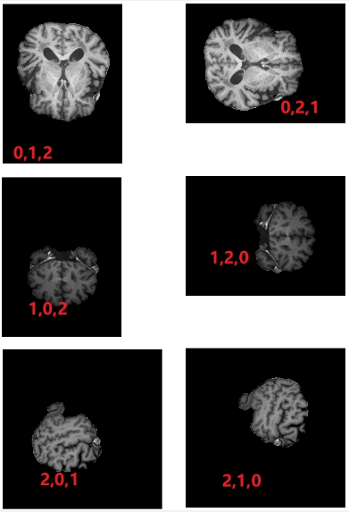

# MRILoader

version 1.5 2022/4/29

## はじめに

このプロジェクトは主に、niiおよびnii.gz形式のシングルチャネルMRI画像が正規化されていない問題を解決し、さらにいくつかのヘルパー関数も提供します。

## 準備

依存関係と環境

<code>
    Python 3.7、
    opencv、
    numpy、
    SimpleITK
</code>

<p>
    パッケージではなく、MRILoader.pyファイルが直接提供されています。プロジェクトの適切なフォルダーに配置すればいいです。
</p>

<code>from MRILoader import MRILoader,MultipleMRILoader
</code>

## 前提知識

**スライス**：MRIで出力される画像は（スライス数,w,h）の3次元画像であるため、複数の画像で構成され、本プロジェクトで各画像はスライスと呼はれます。

**正規化**：MRIスライスの画素値の上限は固定されていないため、多くの場合、最大値は数百または数千まで付けられるが、通常のRGB画像の画素値は0〜 255なので、正規化して、スライスの画素値を0から255の範囲に統合する必要があります。 getNormalizeSlicesメソッドを使用して、正規化されたスライスを取得できます。

**3チャンネル化**：正規化後、MRIスライスの画素値は0〜255になりますが、まだシングルチャネル（グレースケール）画像のままになってしいます。しかし、RGBのような3チャンネルの画像に変換して、処理する必要がある場合が多く存在し、これで、normalizeSlicesToTernaryメソッドを使って、3つのチャネルに変換します。getNormalizeSlicesTernaryメソッドを使って、3チャネル化されたスライス配列を取得することができます。

**スライス方向（Position）**：読み取ったMRIスライスの向きは必ずしも正しい方向ではないため、次元の順番を調整することで各向きのスライスを取得できます。本プロジェクトは[（0, 1,2）、（0,2,1）]を水平断面、[（1,2,0）、（1,0,2）]を冠状断面、[（2,1,0）、（2,0,1）]を矢状断面のデータに基づいて開発しています（下図を参照）。



データの構造が一致であれば、コンストラクター、getChangePostionSlices、getMultiplePositionSlicesなどのメソッドで、Positionに文字列で向きを指定されている場合、自動的に向きを調整します。 ただし、異なる構造のデータの場合は、rot90およびflipパラメーターで修正する必要があります。

**スライス回転（rot90）**：Numpyのrot90メソッドに基づいて、90度ごとスライスを時計回りまたは反時計で回転することができます。しかし、MRIスライスの特殊性により、期待どおりに回転しない場合があります。指定された方向に回転することを実現するためにflipと一緒に使用することがおすすめです。

**スライスフリップ（flip）**：Numpyのflipメソッドに基づいて、上下または左右にフリップすることができます。しかし、MRIスライスの特殊性により、期待どおりにフリップされない場合があります。指定された方向にフリップすることを実現するためにrot90と一緒に使用することがおすすめです。

**ブラックフレーム（Black Frame）**：多くのメソッドにはblackパラメータがあります。これは、MRIスライス配列に多数のブラックスライスが存在しています。ブラックパラメータをFalseに設定すれば、ブラックスライスを削除することができます。

## メソッド

### MRILoaderクラス（単一MRIファイルの読み込み）

<h4>コンストラクター__init__(self, path=None,slices=None,position=None,rot90=None,flip=None)</h4>

<p>
MRILoaderオブジェクトを初期化する時に、MRIファイルパスをpathパラメータに直接渡し、対応するファイルが自動的に読み込まれます。<br/>
MRIは通常3つの断面(水平断面、冠状断面、矢状断面)がありますが、正規化を行うと画素値が圧縮されるため、3つの断面をそれぞれ正規化する必要があります。そうしないと深刻な層状現象が発生します。コンストラクターは一方向の断面のみが初期化されます(指定しないと読み込まれたデータのデフォルト方向が初期化されます)。方向を指定する必要がある場合は、position、rot 90、flipの3つのパラメータで調整できます。後で方向を調整する必要がある場合は、getChangePostionSlicesメソッドまたはgetMultiplePositionSlicesメソッドを呼び出す必要があります。どちらのメソッドもクラス内のメンバーフィールドに直接影響しません。
</p>

<b>参数列表</b>

- **path:** nii/nii.gzファイルのパス

- **slices:** MRIスライス配列。指定された場合はpathパラメータを無視されます。

- **postion**:

  MRIスライスの次元順番を調整するパラメータです。

  次元の順番並び替えことで、異なる断面に切り替えることができます。詳しい値は前提知識のスライス方向に参照してください。

  並べ方が知らない場合は、以下の文字列で指定しても可能です。
  
  - axial、transverse、z 　水平断面
  
  - coronal、x 　冠状断面
  
  - sagittal、y 　矢状断面
  
  注意する必要があるのは、データ構造によって、正しく並べ変えないの場合がありますので、その場合はrot90やflipパラメータで調整する必要があります。詳しくは前提知識のスライス方向に参照してください。


- **rot90:** スライスフリップ，90度ごとで正の値は反時計回り、負の値は時計回りで、1を指定した時は反時計回りに90度回転し、2は反時計回りに180度回転し、-1は時計回りに90度回転します。しかし、期待どおりに回転しない場合があります。指定された方向に回転することを実現するためにflipと一緒に使用することがおすすめです。

- **flip:** スライスフリップ，入力値は次元、0は上下反転、入力1は左右反転です。 しかし、期待どおりにフリップされない場合があります。指定された方向にフリップすることを実現するためにrot90と一緒に使用することがおすすめです。

  ```python
  loader = MRILoader('./data/CC003/T1w_bscorr_SS.nii.gz')
  ```
  
  

<h4>.normalize() </h4>
<p>
このメソッドは通常自動的に呼び出されますので、通常は手動で呼び出す必要はありません。<br/>
読み取ったデータを正規化して画素値を0~255の範囲になるが、この場合はまだシングルチャネルであるため、そのままで出力することはできません(matplotlibなら可能)。この関数はgetNormalizeSlices、normalizeSlicesToTernaryで自動的に呼び出されます。
</p>

<h4>.normalizeSlicesToTernary(reset=False)</h4>
<p>
このメソッドは通常自動的に呼び出されますので、通常は手動で呼び出す必要はありません。<br/>
このメソッドでは、正規化されたシングルチャネルデータを3チャネル、つまりRGBに変換できます。まだ正規化が行われていなければ、自動的に正規化されます。
</p>


**参数列表**

- **reset**:Trueの場合は既に3チャネル化されていても、もう一度3チャネル化がを行います。

<h4>.getNormalizeSlices(black=True,reset=False,reset=False)</h4>
<p>
获取归一化后的MRI切片图，如果没有归一化会自动进行归一化
</p>

**参数列表**

- **black**:是否包含纯黑的切片，如果包含的话就是True（默认），如果希望不包含的话就是False。
- **reset**:默认值False，为True时即便是已经被三通道化过了，也重新进行三通道化

```python
normalize=loader.getNormalizeSlices()
```


<h4>.getNormalizeSlicesTernary(black=True,reset=False)</h4>
<p>
获取三通道化后的MRI切片图，如果没有三通道化会自动进行三通道化（同样如果没有归一化，会先进行归一化再进行三通道化）。(切片序号,w，h)


**参数列表**

- **black**:是否包含纯黑的切片，如果包含的话就是True（默认），如果希望不包含的话就是False。
- **reset**:默认值False，为True时即便是已经被三通道化过了，也重新进行三通道化

```python
normalizeSlicesTernary=loader.getNormalizeSlicesTernary()
```


<h4>.changePosition(slices,position,rot90=None,flip=None,black=True,type='ternary')</h4>

<p>获取指定方位的MRI切片数组。通常来说不会直接调用此方法，想要获取指定方位的MRI切片数组请getChangePostionSlices方法进行</p>

**参数列表**

- **slices:** MRI切片数组（必须是并未经本方法或其他方法改变数组维度的单通道原始数组，因为必须改变断面后再进行归一化和三通道，否则会出现断层问题）

- **postion**:

  MRI的切片维度方位，接收值为三个成员的元组/列表或字符串。

  维度方位，接收值为三个成员的元组/列表。 传入元组/列表时，基于numpy的transpose方法，可以使用rot90（基于numpy的rot90方法）、flip（基于numpy的flip方法）参数调节视图方向

- **rot90:** 切片旋转，以90度为单位，传入正值为逆时针，负值为顺时针，传入1代表逆时针旋转90度，2代表逆时针旋转180度，-1代表顺时针旋转90度，以此类推。 但要注意，MRI切片数组较为特殊，有时并不会以期待的方式运行，需要自行调节。

- **flip:** 切片翻转，输入值为维度，输入0为上下翻转，输入1为左右翻转。 但要注意，MRI切片数组较为特殊，有时并不会以期待的方式运行，需要自行调节。

  MRILoader基于下图所示的原始数据进行开发，请提前确认结构。（红色字体为对应维度输出的切片，对应numpy的transpose方法）

- **black:** 是否包含纯黑帧，只有slices为None或为字符串时生效，默认为包含（True）

- **type:** 因为输入必须是单通道原始切片，所以可以选择输出时是否进行转换，默认值ternary输出归一化后的三通道切片。normalize或normalizeslices输出归一化切片，其他则依然输出单通道原始切片。

```python
slices=某MRI切片数组
#将输入的slices切片数组，维度改为1,0,2排列，之后，逆时针旋转180度，上下翻转
slices=loader.changePosition(slices,(1,0,2),2,0)
```


<h4>.getChangePostionSlices(slices=None,position=None,rot90=None,flip=None,black=True,type="ternary")</h4>

<p>
获取指定方位的MRI切片数组。对changePosition进行包装实现参数可以接收字符串，提高易用性的效果。
</p>

**参数列表**

- **slices:** MRI切片数组（必须是并未经本方法或其他方法改变数组维度的单通道原始数组，因为必须改变断面后再进行归一化和三通道，否则会出现断层问题），默认值为None，可以为MRI切片数组、None、字符串。

  - **切片数组:** 将传入本方法的MRI切片数组更改为指定方向。
  - **None**:默认，使用从本地读取或传入本对象的slices作为切片数组，但不会进行Inplace操作修改对象内的slices变量，有需求请自行修改（修改后需要重新归一化和三通道化）。
  
- **postion**:

  MRI的切片维度方位，接收值为三个成员的元组/列表或字符串。

  传入元组/列表时，基于numpy的transpose方法，通过使用rot90、flip参数调换维度的方式更改MRI切片方向，如果不知道如何调换可以传入字符串由方法自动调换。

  可以传入以下字符串，自动调整至对应断面。

  - axial或transverse或z 水平断面
  - coronal或x 冠状面
  - sagittal或y 矢状面

​		但要注意，由于传入的MRI切片数组数据的不同，可能无法正确读取对应面，请自行确认。

​		传入字符串时同样可以使用rot90、flip参数调节视图方向，如果不传入rot90和flip，将由方法内置逻辑对切片方位进行处理。

- **rot90:** 切片旋转，以90度为单位，传入正值为逆时针，负值为顺时针，传入1代表逆时针旋转90度，2代表逆时针旋转180度，-1代表顺时针旋转90度，以此类推。 但要注意，MRI切片数组较为特殊，有时并不会以期待的方式运行，需要自行调节。

- **flip:** 切片翻转，输入值为维度，输入0为上下翻转，输入1为左右翻转。 但要注意，MRI切片数组较为特殊，有时并不会以期待的方式运行，需要自行调节。

  MRILoader基于下图所示的原始数据进行开发，请提前确认结构。（红色字体为对应维度输出的切片，对应numpy的transpose方法）

-  **black:** 是否包含纯黑帧，只有slices为None或为字符串时生效，默认为包含（True）

- **type:** 因为输入必须是单通道原始切片，所以可以选择输出时是否进行转换，默认值ternary输出归一化后的三通道切片。normalize或normalizeslices输出归一化切片，其他则依然输出单通道原始切片。

```python
slices=loader.getChangePostionSlices(position="z") #将loader.slices，切换至水平断面
```


<h4>.getMultiplePositionSlices(slices=None,position=None,rot90=None,flip=None,black=True,type="ternary")</h4>

<p>
同时获取多个方位的MRI切片数组。可以获取包含同一个MRI的多个方位的MRI切片数组，结构为（方位下标,切片序号,w,h），方位序号根据position的传入顺序进行决定。内部调用了getChangePostionSlices方法。
</p>

**参数列表**

- **slices:** MRI切片数组（必须是并未经本方法或其他方法改变数组维度的单通道原始数组，因为必须改变断面后再进行归一化和三通道，否则会出现断层问题），默认值为None，可以为MRI切片数组、None、字符串。

  - **切片数组:** 将传入本方法的MRI切片数组更改为指定方向。
  - **None**:默认，使用从本地读取或传入本对象的slices作为切片数组，但不会进行Inplace操作修改对象内的slices变量，有需求请自行修改（修改后需要重新归一化和三通道化）。
  
- **postion**:

  MRI的切片维度方位数组，接收值为n*3的元组/数组或一维字符串数组，也可以混搭。默认None时则代表获取三个断面。

  例如[[0,1,2],"z",[2,1,0]]，这样可以获取三个不同方位的切片。
  元组/列表和字符串的具体值参照如下。

  传入元组/列表时，基于numpy的transpose方法，通过使用rot90、flip参数调换维度的方式更改MRI切片方向，如果不知道如何调换可以传入字符串由方法自动调换。

  可以传入包含以下字符串的一维数组，自动调整至对应断面。

  - axial或transverse或z 水平断面
  - coronal或x 冠状面
  - sagittal或y 矢状面

​		但要注意，由于传入的MRI切片数组数据的不同，可能无法正确读取对应面，请自行确认。

​		传入字符串时同样可以使用rot90、flip参数调节视图方向，如果不传入rot90和flip，将由方法内置逻辑对切片方位进行处理。

- **rot90:** 切片旋转一维数组，需要与position成员对应，如果不需要调整需要用None占位，当然如果都不需要调整使用默认None即可，以90度为单位，传入正值为逆时针，负值为顺时针，传入1代表逆时针旋转90度，2代表逆时针旋转180度，-1代表顺时针旋转90度，以此类推。但要注意，MRI较为特殊，有时并不会以期待的方式运行，需要自行调节。
- **flip:** 切片翻转一维数组，需要与position成员对应，如果不需要调整需要用None占位，当然如果都不需要调整使用默认None即可，输入值为维度，输入0为上下翻转，输入1为左右翻转。但要注意，MRI较为特殊，有时并不会以期待的方式运行，需要自行调节。
- **black:** 是否包含纯黑帧，只有slices为None或为字符串时生效，默认为包含（True）
- **type:** 因为输入必须是单通道原始切片，所以可以选择输出时是否进行转换，默认值ternary输出归一化后的三通道切片。normalize或normalizeslices输出归一化切片，其他值则依然输出单通道原始切片。

```python
#生成loader.slices的(0,2,1)、冠状面、(2,3,1)的切片数组，对(0,2,1)逆时针旋转90度，对(2,3,1)顺时针旋转180度。
slices=loader.getMultiplePositionSlices(position=[(0,2,1),"x",[2,3,1]],rot90=[1,None,-2]) 
```


<h4>.display(num=0,slices=None)</h4>
<p>
用于显示读取的MRI图片，无需提前调用其他方法，如果检测到未将图片处理为RGB会自动先进行处理。num为显示第num张MRI图。(切片序号,w，h)

**参数列表**

- **num:** 切片序号

- **slices:** 显示这个切片数组的第num个切片

```python
loader.display()
```


<h4>.save(savePath="./save/", r=None, folderName="", fileName="", suffix=".jpg", num=None, black=True)</h4>

用于保存MRI图片

**参数列表**

- **savePath**:存储路径
- **r**:范围，默认是全部，传入数字就是第n张，传入一个列表就是范围，如果列表中有多个值，那会用列表中第一个和最后一个成员作为范围。
- **fileName:** 文件名,不填的话就用MRI（单张时）或序号（多张时）做文件名（填写的话会用名字_序号作为文件名），如果只保存一张则不会添加序号
- **suffix**:文件后缀名
- **black**:是否包含纯黑的切片，如果包含的话就是True（默认），如果希望不包含的话就是False。如果是其他情况需要判断是否是纯黑切片请参照loader.blackMap ，这个内部数组内存储了纯黑切片的下标

```python
loader.save()
```


### MultipleMRILoaderクラス（複数MRIファイルの読み込み）

<h4>コンストラクター__init__(self, path,position=None,rot90=None,flip=None)</h4>
<p>
这里的路径需要使用glob表达式传入需要的文件，可以使用*作为通配符，不能直接传入文件夹路径。<br/>
提示：*.nii 代表后缀名为nii的文件，*.nii*代表，包含.nii的文件，例如.nii、.nii.gz。<br/>
例如我们想要获取data文件夹（与当前文件在同一文件夹时）下所有子文件夹里的nii和nii.gz文件时，就可以使用 ./data/*/*.nii*。
每次初始化仅会统一对一个方向的断面进行初始化（未指定的话就对读取的文件原始数组默认方向进行初始化）
如果需要指定方向，可以通过position、rot90、flip三个参数进行调整。
</p>


**参数列表**

- **path:** nii数据的路径

- **postion**:

  MRI的切片维度方位，接收值为三个成员的元组或字符串。

  传入元组时，基于numpy的transpose方法，通过使用rot90、flip参数调换维度的方式更改MRI切片方向，如果不知道如何调换可以传入字符串由方法自动调换。

  传入元组时可以使用，rot90（基于numpy的rot90方法）、flip（基于numpy的flip方法）参数调节视图方向

  - axial或transverse或z 水平断面
  - coronal或x 冠状面
  - sagittal或y 矢状面

​		但要注意，由于传入的MRI切片数组数据的不同，可能无法正确读取对应面，请自行确认。

​		传入字符串时同样可以使用rot90、flip参数调节视图方向，如果不传入rot90和flip，将由方法内置逻辑对切片方位进行处

- **rot90:** 切片旋转，以90度为单位，传入正值为逆时针，负值为顺时针，传入1代表逆时针旋转90度，2代表逆时针旋转180度，-1代表顺时针旋转90度，以此类推。 但要注意，MRI切片数组较为特殊，有时并不会以期待的方式运行，需要自行调节。

- **flip:** 切片翻转，输入值为维度，输入0为上下翻转，输入1为左右翻转。 但要注意，MRI切片数组较为特殊，有时并不会以期待的方式运行，需要自行调节。

```python
loaders = MultipleMRILoader('./data/*/T1w*.nii*')
```


<h4>.getNormalizeSlices(black=True,reset=False)</h4>
<p>
获取归一后的MRI切片图，如果没有归一化会自动进行归一化，拿到的切片数据列表维度是以(文件序号,切片序号,w，h)的方式排列的。
</p>

**参数列表**

- **black**:是否包含纯黑的切片，如果包含的话就是True（默认），如果希望不包含的话就是False。
- **reset**:默认值False，为True时即便是已经被三通道化过了，也重新进行三通道化

```python
normalizeSlices=loaders.getNormalizeSlices()
```


<h4>.getNormalizeSlicesTernary(black=True,reset=False)</h4>
<p>
获取三通道化后的MRI切片图，如果没有三通道化会自动进行三通道化（同样如果没有归一化，会先进行归一化再进行三通道化）
拿到的切片数据列表维度是以(文件序号,切片序号,w，h)的方式排列的
</p>

**参数列表**

- **black**:是否包含纯黑的切片，如果包含的话就是True（默认），如果希望不包含的话就是False。
- **reset**:默认值False，为True时即便是已经被三通道化过了，也重新进行三通道化

```python
normalizeSlicesTernary=loaders.getNormalizeSlicesTernary()
```


<h4>.save(savePath="./save/", r=None, folderName="", fileName="", suffix=".jpg", num=None, black=True)</h4>
<p>
用于批量保存MRI图片

**参数列表**

- **savePath**:存储路径
- **r**:范围，默认是全部，传入数字就是第n张，传入一个列表就是范围，如果列表中有多个值，那会用列表中第一个和最后一个成员作为范围。
- **folderName**:文件夹名，每个MRI文件的切片都分别创建文件夹存储，文件夹名为folderName序号，如果不设置则用序号作为各组MRI切片的文件夹名。要注意如果只保存一个MRI文件的话，默认不会额外为此MRI的切片创建文件夹，但是如果设置了文件夹名则会进行创建。
- **fileName**: 文件名,不填的话就用MRI（单张时）或序号（多张时）做文件名（填写的话会用名字_序号作为文件名），如果只保存一张则不会添加序号
- **suffix**:文件后缀名
- **num**:指定只保存第num个MRI文件，超出上限会自动改为最后一个。
- **black**:是否包含纯黑的切片，如果包含的话就是True（默认），如果希望不包含的话就是False。如果是其他情况需要判断是否是纯黑切片请参照loader.blackMap ，这个内部数组内存储了纯黑切片的下标

```python
loaders.save()
```


## フィールド

-需要注意无Getter方法的成员变量需要自行判断是否被初始化

### MRILoaderクラス

<ul>
<li>
imageObj:存储原始nii文件对象，保存了所有信息，在构造函数调用后可用
</li>
<li>
slices:存储MRI切片，未被归一化和三通道化的原始切片，在构造函数调用后可用。重设slices后，需要手动进行归一化或三值化，不然对应切片无法被更新（可以在使用Getter函数时reset设为True，或手动对应调用方法）。
</li>
<li>
blackMap:存储纯黑色切片的下标的map（对应slices、normalizeSlices、normalizeSlicesTernary），在normalize方法被调用后可用
</li>
<li>
normalizeSlices:存储归一化后的MRI切片，在normalize方法被调用后可用，应使用对应Getter方法，getNormalizeSlices进行获取
</li>
<li>
normalizeSlicesTernary:存储三通道化后的MRI切片，在normalizeSlicesToTernary方法被调用后可用，应使用对应Getter方法，getNormalizeSlicesTernary进行获取
</li>
<li>
notBlacknormalizeSlices:存储不包含纯黑色的归一化后的MRI切片，在getNormalizeSlices方法参数black为False被调用后可用，应使用对应Getter方法，getNormalizeSlices(black=False)进行获取
</li>
<li>
notBlacknormalizeSlicesTernary:存储不包含纯黑色的三通道化后的MRI切片，在getNormalizeSlicesTernary方法参数black为False被调用后可用，应使用对应Getter方法，getNormalizeSlicesTernary(black=False)进行获取
</li>
</ul>


### MultipleMRILoaderクラス

<ul>
<li>
pathArr:存储着所有指定读取的nii、nii.gz文件路径，在构造函数调用后可用
</li>
<li>
loaders:MultipleMRILoader会为每个nii、nii.gz文件创建一个MRILoader类型的对象，这些对象存储在loaders中，在构造函数调用后可用
</li>
<li>
normalizeSlices:存储归一化后的MRI切片，应使用对应Getter方法，getNormalizeSlices进行获取
</li>
<li>
normalizeSlicesTernary:存储三通道化后的MRI切片，应使用对应Getter方法，getNormalizeSlicesTernary进行获取
</li>
<li>
notBlacknormalizeSlices:存储不包含纯黑色的归一化后的MRI切片，在getNormalizeSlices方法参数black为False被调用后可用，应使用对应Getter方法，getNormalizeSlices(black=False)进行获取
</li>
<li>
notBlacknormalizeSlicesTernary:存储不包含纯黑色的三通道化后的MRI切片，在getNormalizeSlicesTernary方法参数black为False被调用后可用，应使用对应Getter方法，getNormalizeSlicesTernary(black=False)进行获取
</li>


